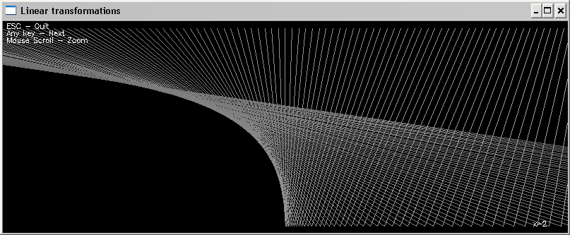
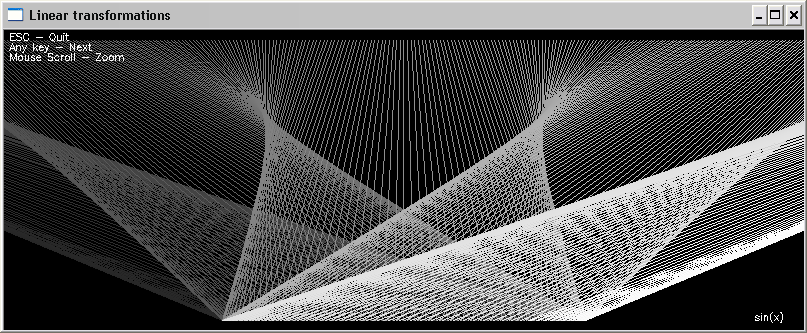
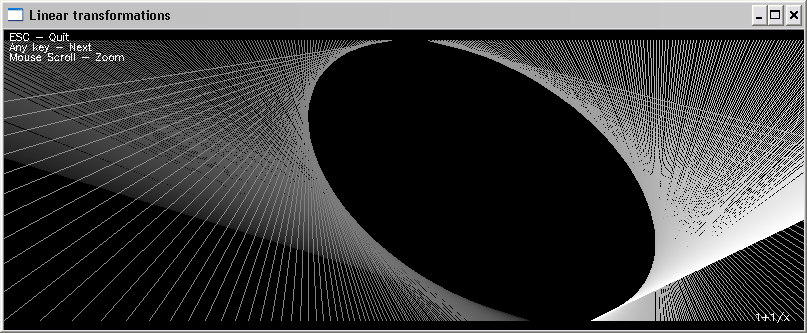
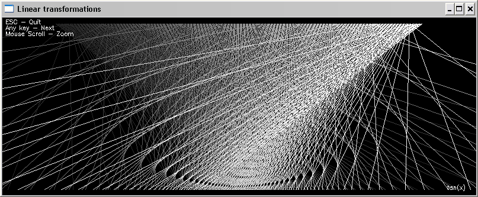

# PyLinTransform
Linear Transformations

Some screenshots:

## Control keys:

| Keys | Desctiption |
| --- | --- |
| Q/q | Close window and exit |
| ESC | The same as 'Q' |
| Any key | Show next function |
| Left/Right Mouse button click | The same as Any key |
| Mouse Scroll Ud and Down| Zoom in and out |

## Requirements:

* Python
* NumPY
* OpenCV

## Files:
	
* [lintransform.py](lintransform.py) - Main program
* README.md - This readme file
* LICENSE - GNU GENERAL PUBLIC LICENSE

# AUTHOR
   An0ther0ne

# SEE ALSO
* [What they won't teach you in calculus](https://www.youtube.com/watch?v=CfW845LNObM)
